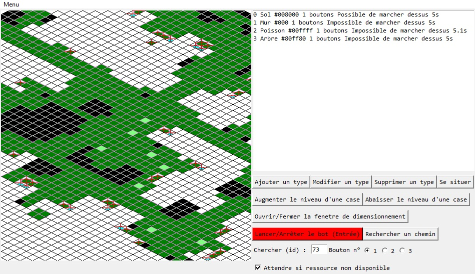
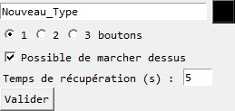

# Python-Wakfu-Farm-Bot

This is a program that can control you mouse to farm automatically ressources in the game named "Wakfu".
## Features
- Save and load ressources maps
- Create ressource types
- Can use any of the ressource buttons
- Supports the terrain elevation
- Testing maps
## Installation
1. Download the repository by clicking on `Code > Download ZIP`
2. Extract the ZIP file
3. Run `main.pyw`
## Requirements
- Python 3.7
- Python `tkinter` library
- Python `pyautogui` library
- Python `keyboard` library
- Python `math` library
## Usage
First of all you have to add tiles types by clicking on `Ajouter un type`.

Then you can personalize the new type.

Once you have finish to add tiles types you can draw the map.

Using `Augmenter le niveau d'une case` and `Abaisser le niveau d'une case` you can modify the elevation of tiles.

When the map is ready you can ajust the program den by clicking on `Ouvrir/Fermer la fenetre de dimensionnement`.

The rect have to match with the Wakfu window and the center diamond have to match with the tile your character stand on.

Once your are ready you can click on `Lancer/Arrêter le bot` and let the program run.

When you want to stop it you can press `ENTER`.